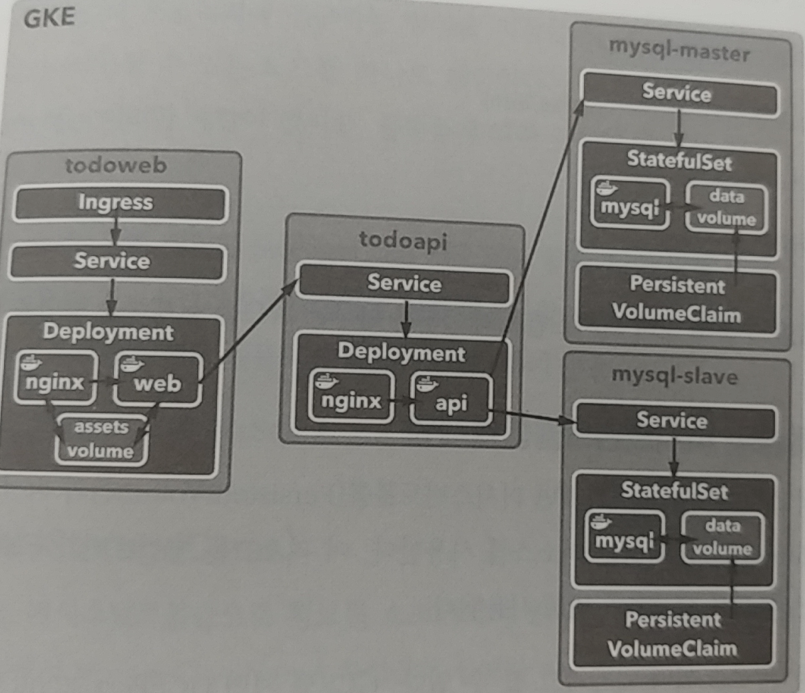

# Google kubernetes Engine 에 todo app service create
ref textbook: 도커/쿠버네티스를 활용한 컨테이너 개발 실전 입문 ch06

# Structure

1) todoweb service (Ingress)

- nginx_nutx image (ch04)
- todoweb image (ch04)

2) todoapi service

- nginx image (ch04)
- todoapi image (ch04)

3) mysql db service

- tododb image (ch04)
  : slave & master 대응 (파라미터로 대응)

## apply yaml 

1) backend db service 

kubectl apply -f persistent-volume-claim.yml
kubectl apply -f storage-class-standard.yml
kubectl apply -f mysql-master.yaml
kubectl apply -f mysql-slave.yaml

kubectl exec -it mysql-master-0 init-data.sh

kubectl exec -it mysql-slave-0 -- bash
  
  $ mysql -u root -pgihyo tododb -e "SHOW TABLES;"

2) api service

kubectl apply -f todo-api.yaml

3) front-end service

kubectl apply -f todo-web.yaml
kubectl apply -f ingress.yaml

4) access to ingress service address and port (after a few minutes)
kubectl get ingress

## reference code from ch04 in textbook

git clone https://github.com/gihyodocker/tododb

git clone https://github.com/gihyodocker/todoapi

copy from todo-app.yml

git clone https://github.com/gihyodocker/todonginx

git clone https://github.com/gihyodocker/todoweb

